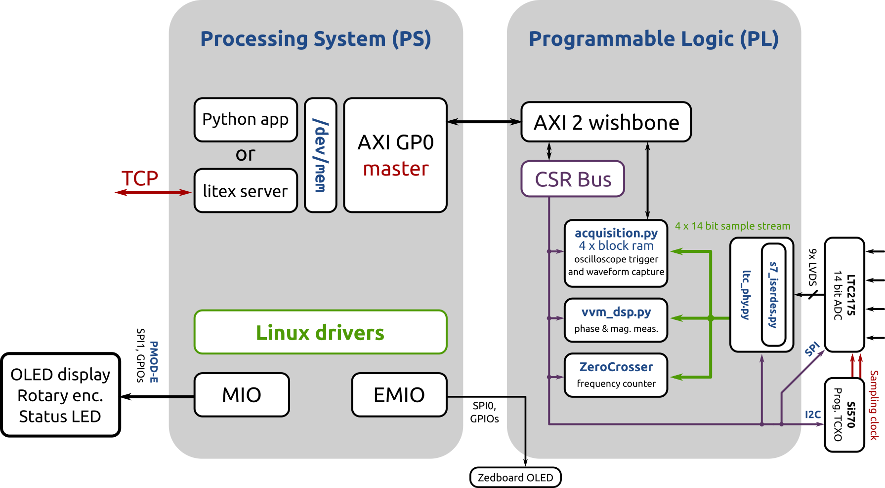
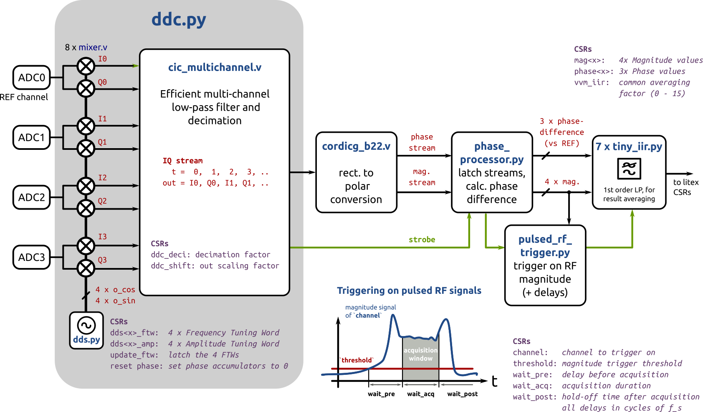
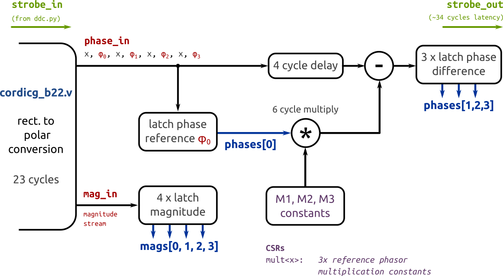

# zed_vvm
A digital RF vector volt-meter (VVM).
Measures amplitude and phase of a sinusoidal signal under test against a reference signal of same frequency.
Intended as an instrument to monitor and troubleshoot legacy accelerator RF systems.


Based on a Digilent Zedboard running Debian with a DC1525A FMC daughter board on top.

  * 4 channel, 14 bit, 125 MSps, 800 MHz bandwidth (3 dB) analog to digital converter with LVDS interface: [__LTC2175-14__](https://www.analog.com/en/products/ltc2175-14.html)
  * Sampling clock provided by a `Si5xx-PROG_EVB` evaluation board running [custom firmware](https://github.com/yetifrisstlama/Si5xx-5x7-EVV_autoloader)
  * 4 x 4096 sample buffer with oscilloscope-like trigger for raw ADC waveform storage (`scope_app.py` makes use of that)
  * FPGA implements
    * digital down-conversion and decimation to get a complex baseband (IQ) signal
    * rectangular (IQ) to polar conversion (magnitude, phase)
    * first order IIR filter to smooth the measurement result
    * uses [Bedrock](https://github.com/BerkeleyLab/Bedrock) DSP blocks
    * makes good use of [litex](https://github.com/enjoy-digital/litex) Control/Status Registers (CSRs), the wishbone2axi bridge and litex_server to make the measurements available to linux running on the CPU

The main reason to choose embedded linux is the convenience for application development:
  * python3 support with numpy / scipy or even jupyter notebook
  * `sudo apt install <whatever_you_need>`
  * ssh and scp make remote access secure and easy, even on the public internet
  * remote loading of bit-files through scp is very convenient
  * litex_server can run on the zedboard, making access to CSR-registers over
    ethernet easy and transparent. The TCP connection is tunneled trough ssh,
    making it secure
  * can run epics IOC, mosquitto client or many other tools to publish
    measurement results

# Minimum design goals
  * support 125 MHz & 500 MHz signals
  * Same phase reading after power cycle (manage clock divider states)
  * 360 degree unique measurement range
  * Phase accuracy over a temperature range of 20 - 30 degC of better than 1 deg (0.2 %)
  * Less than 2 % amplitude error
  * At least 2 input channels + one phase reference channel
  * Self-contained instrument (only power is needed)
  * Easy to use
  * Not too expensive, such that it can be installed in multiple places across the facility
  * Epics support

# System block diagram


# `vvm_dsp.py` block diagram


# `phase_processor.py` block diagram



# Hardware modifications
## Zedboard
  * remove XADC header (J2) as it interferes with the DC1525A board

## DC1525A
  * Setup the board for differential sample clock input
    * Move R101 to R64 (0 Ohm jumper)
  * Remove low-pass filter on the analog input channels
    * Remove: R37, R38, R53, R54, R80, R81, R90, R91
    * Remove: R35, R52, R79, R89
    * Replace by 0 Ohm jumper: L4, L5, L6, L12

# Installing litex
... on debian
```bash
$ sudo apt install libevent-dev libjson-c-dev
$ sudo pip3 install virtualenvwrapper
$ mkvirtualenv litex
$ git clone git@github.com:yetifrisstlama/litex.git --recursive
$ cd litex
$ python litex_setup.py init
$ python litex_setup.py install
$ python setup.py develop
```

# Building the .bit file
Most of the DSP blocks are from LBLs `Bedrock` repo, which needs to be cloned
in the same directory as `zed_vvm`.

Vivado needs to be installed an in the PATH. I use v2019.1.

Setup your zedboard host-name in `util/remote_config_fpga.sh` and
`util/remote_litex_server.sh`.

Note that the Zedboard PS will freeze if the FPGA is not loaded / in the process of being loaded and there is a
AXI memory access through litex_server. So make sure to close the python apps before doing `make upload`.

```bash
$ git clone https://github.com/yetifrisstlama/zed_vvm.git
$ git clone https://github.com/BerkeleyLab/Bedrock.git
$ cd zed_vvm
$ workon litex
$ make
# remote FPGA configuration
$ make upload
# start litex_server on zedboard for remote access to FPGA registers
$ make server
# Keep this terminal open and start a new one
```

### Demonstration apps
```bash
$ cd util
# displays raw ADC samples in time and frequency domain
$ python3 scope_app.py
# displays RF magnitude and phase over time
$ python3 vvm_app.py
# try -h to list supported command line arguments
```

# Setting up linux
[ZED_DEBIAN.md](https://github.com/yetifrisstlama/zed_vvm/blob/master/ZED_DEBIAN.md)

# Setting up Peripherals
How to connect Linux to the FPGA or the outside world. WIP ...

[PS_PERIPHERALS.md](https://github.com/yetifrisstlama/zed_vvm/blob/master/PS_PERIPHERALS.md)

# Load bitfile in linux
Bitfiles are loaded trough the [Linux FPGA Manager](https://www.kernel.org/doc/html/v4.18/driver-api/fpga/fpga-mgr.html).
For this to work, the .bit file needs its header removed and its bytes swapped.
This can either be done with the xilinx SDK or alternatively with `bitstream_fix.py`.
```bash
python3 util/bitstream_fix.py <bitfile>.bit
```

copy the resulting `<bitfile>.bit.bin` on the zedboard, then

```bash
    sudo -i
    cp <bitfile>.bit.bin /lib/firmware/
    echo 0 > /sys/class/fpga_manager/fpga0/flags
    echo <bitfile>.bit.bin > /sys/class/fpga_manager/fpga0/firmware
    dmesg

[ 1667.020520] fpga_manager fpga0: writing <bitfile>.bit.bin to Xilinx Zynq FPGA Manager
```

`make upload` automates all these steps.

# remote litex_server
`./util/linux/litex_server` contains a minimal version of which can run on the zedboard. It only requires python3 installed. It needs sudo to open `/dev/mem`, so it is dangerous! It then connects to the general purpose AXI master (gp0) at address 0x43c00000. On the PL side, this is connected to an AXI to Wishbone converter to read and write the CSRs.

## GP0 address range
The Zynq general purpose AXI master interfaces are mapped to these addresses in memory

| Start     | End      | Size               | Interface |
| --------- | -------- | ------------------ | --------- |
| 4000_0000 | 7FFF_FFF | 3800_0000 (896 MB) | M_AXI_GP0 |
| 8000_0000 | BFFF_FFF | 3800_0000 (896 MB) | M_AXI_GP1 |

The AXI to wishbone adapter subtracts an offset (base_address) and removes the 2 LSB bits so we get word addresses.
See mapping below.

```python
self.add_axi_to_wishbone(self.axi_gp0, base_address=0x4000_0000)
```

| AXI (devmem) | WB << 2     | WB           |
| ------------ | ----------- | ------------ |
| 0x4000_0000  | 0x0000_0000 | 0x0000_0000  |
| 0x4000_0004  | 0x0000_0004 | 0x0000_0001  |
| 0x7FFF_FFFC  | 0x3FFF_FFFC | 0x0FFF_FFFF  |
